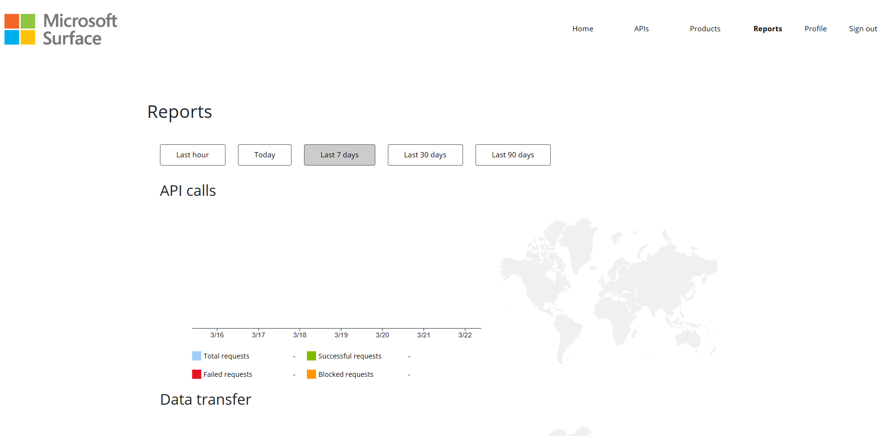

# Surface API Mananagement Service

The Surface API Management Service is a collection of APIs that allow for management of your organization's Surface devices.

## Obtaining API access
Permissions to call the Surface API Manangement Service are provided on an as-needed basis. Access confirmation may take up to 5 business days from the moment you submit your request.​

Please note that access to the Surface API Management Service will be initially limited to a few customer tenants, but will scale progressively after the first 6 months of operation. We thank you in advance for your patience.

### Requirements to access this service
1. An active Surface Management Portal Account
2. Complete customer validation check
   * If you are not sure, find your customer validation status [here](https://intune.microsoft.com/#view/Microsoft_Azure_Surface/CreateRepairRequestV2.ReactView). If you have access, you will access the flow; if not, complete the customer validation check on the page.

### Request onboarding
To begin onboarding, send an email to surfaceapimanagement@microsoft.com with the following information:

> Subject: "Requesting Access to Surface API Management Service"

In the body, please provide:
> * Company name
> * Tenant id[^1]
> * Tenant primary domain[^1] (ex. contoso.onmicrosoft.com)
> * Application (client) id[^2]
> * Estimated quantity of Intune-registered Surface devices

Upon approval of your request, you will receive a link to the Surface API Management Service Portal which will allow you to subscribe to the available APIs.

[^1]: See [Find the Microsoft Entra tenant ID and primary domain name](https://learn.microsoft.com/en-us/partner-center/find-ids-and-domain-names#find-the-microsoft-entra-tenant-id-and-primary-domain-name).
[^2]: See [Create a Microsoft Entra application and service principal that can access resources](https://learn.microsoft.com/entra/identity-platform/howto-create-service-principal-portal)

# Developer portal

## Sign in

Once you have been added to the access list, you will receive a link to the developer portal to subscribe to the available APIs.


1. Sign in using the approved Tenant using Azure Active Directory.
   - You must sign in using the admin profile for the account.
2. Complete the Sign up request details.

## Subscribing to a Product

Once you have logged in, you are able to view the APIs available within a Product. To access and use these APIs, you will need to subscribe to the Product associated to the API.


1. Select the Product menu to view the products and APIs associated to it.
2. Once you have identified the product you wish to subscribe to, enter a name in the Subscription text box and hit Subscribe.
3. This will generate subscription keys available on the User profile screen.


## Reports

Once you are actively using APIs you will be able to see reporting metrics and usage data on the reports page.



# APIs

## Making API calls and code sample

Authentication to the Surface API Management Service is gated by two security checks:
1. Subscription key
   - This must be passed in the request headers as `Ocp-Apim-Subscription-Key`
   - Subscription key can be retrieved from your user profile, as seen in the previous section.
2. Access token
   - The token must be generated from an Entra application of the tenant that you provided during onboarding.
   - The token scope should be `76bd8628-ca60-441c-9d83-06503cbfd9c5/.default`, where the guid is the app id for Surface API Management Service.
   - For instructions on how to create an Entra application and generate a token, see [Create a Microsoft Entra application and service principal that can access resources](https://learn.microsoft.com/entra/identity-platform/howto-create-service-principal-portal).

Please see [SurfaceApiManagementServiceSample](./src/SurfaceApiManagementServiceSample/Program.cs) for sample code that sets these headers and sends a request.

## Warranty and Coverage API

This API provides warranty information for Intune-enrolled Surface devices. Currently, this data is only available in bulk via CSV export.

This API will only provide information for devices registered to the Intune tenant configured during onboarding. If you have devices across multiple tenants, you will need to register each tenant to the Surface API Management Service.

In order for the data to be available, you must first enroll your tenant for scanning:

> `PUT /api/external/warranty/enrollment`

Once enrolled, it may take up to 5 business days to see your populated data via the `export` API. If you receive a 404 error, please wait and try again in a few days.

After the first scan, our services will refresh your tenant's device information biweekly. Please note that if any devices are added/removed from your tenant or any new warranties are added in between scans, the export data may be out-of-date.

The data available through this API is the same as what is available through the Surface Management Portal.

> `GET /api/external/warranty/export`
>
> Response:
> ```
> {
>    "downloadUrl": "url to csv download",
>    "expiresOn": "date/time the downloadUrl will expire on"
> }
> ```

Finally, if you wish to unenroll your tenant, you can do so via:

> `DEL /api/external/warranty/enrollment`
